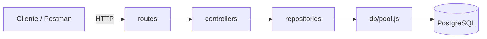
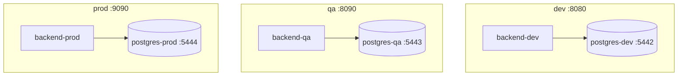

# Arquitectura — customers-app

API REST en capas (Express) para registro de clientes, con un unico codigo base que cambia de comportamiento segun `APP_ENV` (dev, qa, prod), cada uno con su propia base de datos PostgreSQL.

## Capas



- **routes**: define los endpoints (`POST /api/customers`, `GET /api/customers`, `GET /health`).
- **controllers**: valida el input y decide el codigo de respuesta (400, 409, 201).
- **repositories**: unico lugar con SQL (INSERT / SELECT sobre `customers`).
- **db/pool.js**: pool de conexiones `pg`, configurado desde `config/index.js`.

## Ambientes aislados



Cada ambiente corre en su propio contenedor, con su propio puerto y su propia base de datos. `config/index.js` carga `.env.<APP_ENV>` en runtime; nada se hardcodea en el codigo.

## Flujo de una peticion (POST /api/customers)

1. `routes` recibe el request y lo pasa al controller.
2. `controller` valida `name` y `email` (regex + no vacio).
3. `repository.findCustomerByEmail` chequea duplicados (409 si existe).
4. `repository.createCustomer` inserta y retorna la fila creada (201).

## Pruebas (Jest + Supertest)

`tests/customers.test.js` levanta la app Express real (sin mocks) contra una base de datos Postgres real y valida:

- `GET /health` responde con el ambiente y nombre de app activos.
- `POST /api/customers` crea un cliente valido (201).
- `POST /api/customers` rechaza payload sin email (400).
- `POST /api/customers` rechaza email duplicado (409).
- `GET /api/customers` devuelve el cliente recien creado.

```bash
APP_ENV=dev npm test
```

## Build y despliegue

El backend se empaqueta con esbuild en un unico artefacto ejecutable (`dist/app.cjs`), y cada ambiente se levanta con su propio `docker-compose.yml` bajo `docker/`. Detalle de comandos en `README.md`.
